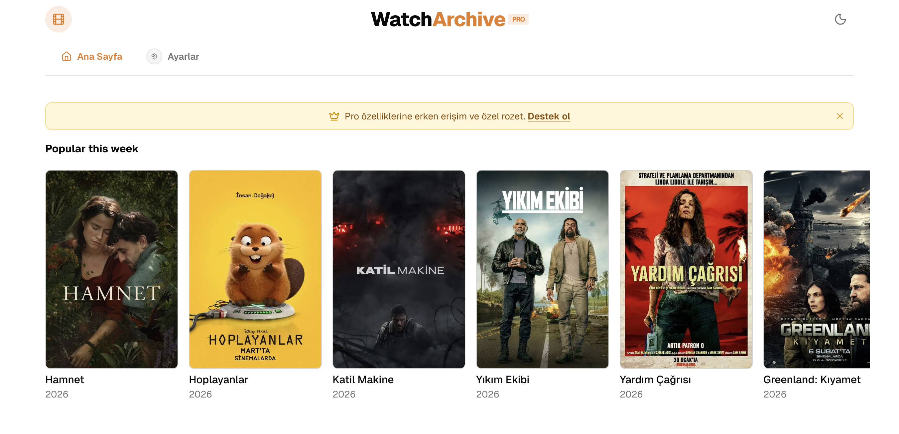

<div align="center">

# WatchArchive

**Film ve dizi keşfet. Güzel, hızlı, açık kaynak.**



[](https://buymeacoffee.com/resatyavcin)

---

</div>

## ✨ Özellikler

- **Popüler içerikler** — Bu haftanın trend film ve dizilerini keşfet
- **Film & Dizi geçişi** — Tek tıkla filmler ve diziler arasında geçiş
- **Detaylı sayfalar** — Arka plan görselleri, posterler, özet, süre, puanlar
- **Koyu / Açık tema** — Sistem temasına uyumlu veya manuel geçiş
- **Responsive tasarım** — Mobil ve masaüstünde sorunsuz çalışır
- **%100 açık kaynak** — MIT lisanslı, istediğin gibi uyarlayabilirsin

## 🛠 Teknoloji

- **Framework:** [Next.js 16](https://nextjs.org/) (Pages Router)
- **UI:** [Tailwind CSS](https://tailwindcss.com/) · [Radix UI](https://radix-ui.com/) · [shadcn/ui](https://ui.shadcn.com/)
- **State:** [Redux Toolkit](https://redux-toolkit.js.org/)
- **İkonlar:** [Lucide](https://lucide.dev/)

## 🚀 Kurulum

### Gereksinimler

- Node.js 18+
- Backend API (veya varsayılan proxy kullanılabilir)

### Yükleme

```bash
git clone https://github.com/resatyavcin/watch-archive.git
cd watch-archive
npm install
```

### Ortam Değişkenleri

`.env.example` dosyasını `.env.local` olarak kopyalayıp yapılandır:

```env
# Backend API (browse ve titles için gerekli)
API_URL=https://your-api-url.com

# Opsiyonel: Destek modalı için Buy Me a Coffee linki
NEXT_PUBLIC_BUYMEACOFFEE_URL=https://buymeacoffee.com/yourusername
```

### Çalıştırma

```bash
npm run dev
```

[http://localhost:3000](http://localhost:3000) adresini aç.

## 📁 Proje Yapısı

```
src/
├── api/           # RTK Query ve API yardımcıları
├── components/    # React bileşenleri
├── lib/           # Yardımcı fonksiyonlar
├── pages/         # Next.js sayfaları ve API route'ları
├── store/         # Redux store
└── types/         # TypeScript tipleri
```

## ☕ Destek

WatchArchive tamamen ücretsiz ve açık kaynak. API, veritabanı ve hosting maliyetleri projenin ayakta kalmasını sağlıyor. Küçük bir destek bile çok işe yarıyor.

[](https://buymeacoffee.com/resatyavcin)

## 📄 Lisans

MIT © [resatyavcin](https://github.com/resatyavcin)
